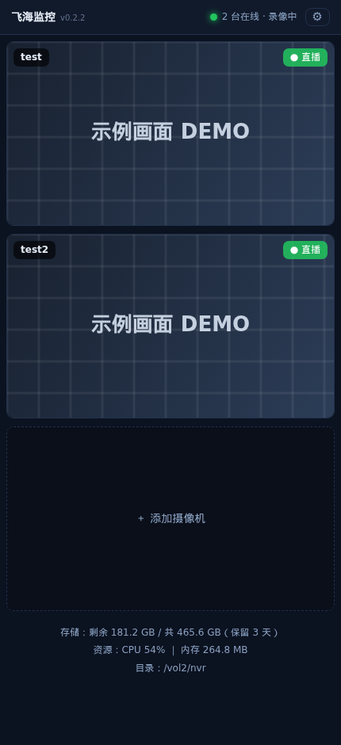
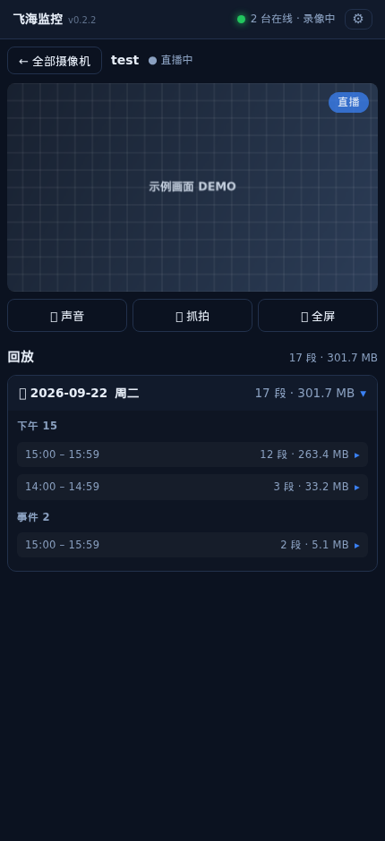
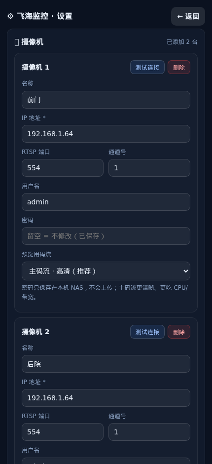
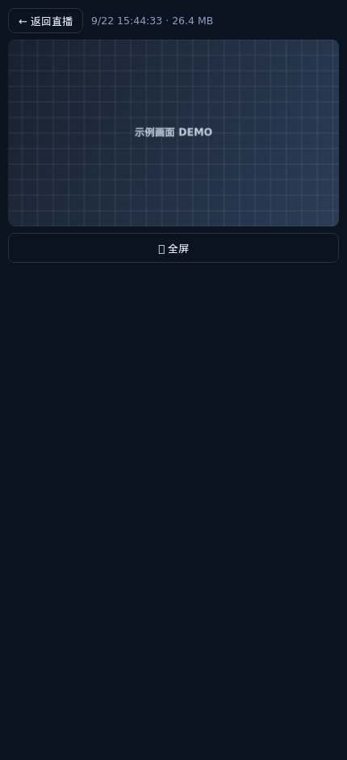

# 在 fnOS 平台搭建一套类似群晖 Surveillance Station 的监控管理套件-飞海监控（FNHK）

> 仓库名 **FNHK**｜飞牛应用 ID（包名）：`fn-hiknvr`

**在 fnOS 平台搭建一套类似群晖 Surveillance Station 的监控管理套件。**

## 📌 项目简介

本项目参考 **群晖 Surveillance Station** 的设计思路进行开发。考虑到大量部署 fnOS 的用户存在将家庭监控设备接入飞牛 NAS 存储与管理的需求，由此发起本项目，旨在满足 fnOS 用户将家庭 IPC 摄像头接入飞牛 NAS 进行集中管理、录像存储的需求。

目前已适配 **海康威视（Hikvision）** 摄像头：实时预览、连续 + 事件双轨录像、网页回放、本地移动侦测。纯本地运行，**只读拉取 RTSP**，数据只存在你自己的 NAS 上；摄像机参数与录像目录都可在应用内配置，支持多台摄像机。

## 🔓 开源与可信（为什么可以放心用）

- **完全开源**：MIT 许可，全部源码都在仓库里，可逐行审计、可自行编译打包（`tools/build.sh`），不需要信任任何第三方
- **无后门、无遥测**：代码里不含统计上报、埋点、广告、云同步或第三方 SDK；**应用不会访问任何外部网络地址**
- **唯一对外连接 = 你自己填的摄像头**（RTSP 拉流）；除此之外它不主动连任何服务器
- **不越界**：只读摄像头 RTSP、只往**你指定的**录像目录写文件；不修改摄像头设置、不动 NAS 上其它应用/目录的数据
- **密码只存本机**：摄像头账号密码保存在 NAS 本机的 `config.json`，不上传、不外发
- **可自行验证**：不放心就 grep 代码；网络行为也可自行抓包核对
- **运行身份**：目前以 `root` 运行（原因与边界见下方「安全与隐私」）

---

## ✨ 功能

- 📹 **实时预览**：首页是以「当前画面快照」为入口的摄像机列表，点进去是单画面直播（同一时间只播一路，省资源）
- 🎬 **直播全屏**：支持全屏观看；竖屏手机会自动旋转画面，按钮按「横屏后你看到的方位」摆放
- 💾 **双轨录像**：主码流连续录像（默认 5 分钟一段）+ 移动侦测事件片，按 `日期 / 上午·下午 / 小时` 分目录
- 🔍 **网页回放**：按天 → 时段 → 小时折叠浏览，支持全屏播放（进度条随播放器）
- 🎯 **本地移动侦测**：拉一路子码流做逐帧差分（不是调摄像头的事件接口，不打扰摄像头）
- 🧩 **多摄像机**：最多 4 台，每台独立管线、独立目录、独立状态
- 📁 **录像目录可选**：想放哪块盘/哪个子目录都行（在设置页里点选）
- 📱 **手机友好**：网页即用，可“添加到主屏幕”当 PWA
- ☁️ **零云端**：不发任何数据出去（不推送、不上传、不需要账号）

## 🖼 截图

| 首页（摄像机列表） | 单画面直播 |
| --- | --- |
|  |  |

| 设置页 | 回放 |
| --- | --- |
|  |  |

*(截图中的画面已打码，仅用于展示界面)*

---

## 📦 环境要求

- **飞牛 fnOS** ≥ 1.2.0（x86_64）
- Node.js 运行时：优先使用飞牛应用中心的 `nodejs_v24`（脚本会自动探测 `nodejs_v24` / `nodejs_v22`）
- **ffmpeg**：默认使用系统的 `ffmpeg`（P3 计划改为随包自带）
- **一台或多台海康威视摄像头**（或海康 NVR 的某个通道），**最多 4 台**，且已开启 RTSP

## 🚀 安装

### 方式一：下载 fpk 安装（推荐）

1. 在 [Releases](../../releases) 下载 `fn-hiknvr-x.y.z.fpk`
2. 飞牛「应用中心 → 手动安装」，选择该 fpk

### 方式二：自己打包

```bash
# 需要飞牛官方的 fnpack（fnOS 自带 /usr/local/bin/fnpack）
tools/build.sh          # 等价于：cd fn-hiknvr && fnpack build
# 产物：fn-hiknvr/fn-hiknvr-<version>.fpk
```

## ⚙️ 首次配置

打开「飞海监控 → 右上角 ⚙」，按卡片填：

1. **名称**：随便起（会作为录像目录名和文件名前缀，中文也行）
2. **IP / 端口**：摄像头地址（RTSP 端口默认 `554`）
3. **用户名 / 密码**：摄像头账号（建议单独建一个只读账号）
4. **通道号**：普通摄像头填 `1`；接在 NVR 上的通道依次 `1、2、3…`（对应 `101/201/301`）
5. **预览码流**：`主码流`（默认，清晰）/ `子码流`（更省资源）
6. 点 **测试连接** → 显示「连接成功 / 分辨率 / 编码」后再 **保存**
7. 需要多台就点 **＋ 添加摄像机**（最多 4 台）
8. **录像保存目录**：点「选择目录」，选一块空间足够的盘/目录

保存后自动开始预览和录像，无需重启。

> ⚠️ **注意摄像头的并发 RTSP 会话上限**（不同型号不同，常见 **3～6 路**，以实测为准）：
> - 本应用每台摄像机占 **2 路**（主码流 1 + 子码流 1）
> - **同一台摄像头不要重复添加** —— 重复添加会重复占用会话，超出上限就会黑屏
> - 如果这台摄像头同时还被 **群晖 Surveillance Station 等其它软件**拉流（例如群晖在录像 1 路），要把那些路数**一起算进总上限**

## 🗂 录像存储

```
<你选的录像目录>/<摄像机名>/<日期>/{上午,下午}/<HH:00-HH:59:59>/<摄像机名>-YYYYMMDD-HHMMSS.mp4
<你选的录像目录>/<摄像机名>/<日期>/事件/<摄像机名>-YYYYMMDD-HHMMSS-E.mp4
```

- 连续录像**按小时分目录**，跨小时会自动切目录；每段默认 **5 分钟**，**可在设置页自定义**
- **保留天数默认 3 天**（超过天数的旧录像自动删除），**天数可在设置页自定义** —— 想留 7 / 15 / 30 天都行
- 文件用普通 mp4（`+faststart`），手机直接可播
- 磁盘剩余不足 **500MB** 时会**自动暂停录像**并在界面提示；等清理掉过期录像、空间恢复后**自动继续**（不会删你的其它数据）

## ❓ 常见问题

**Q：画面黑屏 / 转圈不出画？**
多半是摄像头输出 **H.265(HEVC)**。浏览器不认 H.265，请到摄像头后台
`配置 → 视频/音频 → 视频 → 视频编码` 把 **主码流和子码流都改成 H.264**，保存后重启应用。

**Q：怎么把录像下载到手机？**
飞牛 App 内置浏览器不支持网页下载。请用 **飞牛 App → 文件**，进录像目录拷出来。

**Q：手机物理返回键会退出应用？**
这是飞牛 App 对第三方网页的机制（所有第三方应用都一样），请用页面内的「← 全部摄像机」「← 返回直播」返回。

**Q：加了 2 台以上后不显示 / 卡顿？**
先看**并发会话是不是超了**：① 同一台摄像头被加了两次；② 这台摄像头还有别的软件在拉流（群晖 Surveillance Station 等），路数要**合并计算**。另外把「预览码流」改成子码流会更省资源。

**Q：我想在局域网里直接用 `IP:8091` 打开？**
默认只监听本机（安全考虑）。要局域网访问：改 `config.json` 的 `http.host` 为 `0.0.0.0`，并设置 `http.user` / `http.pass`（**不设口令时局域网访问会被拒绝**）。

**Q：支持别的品牌摄像头吗？**
目前只针对海康威视做了适配与测试。其它品牌若 RTSP 路径兼容，可以「手填 RTSP」碰运气，但**不保证**。

## 🔐 安全与隐私

- 只做 **RTSP 只读拉流**，不会修改摄像头的任何设置
- 账号密码只存在 NAS 本机（`config.json`），不加密传输到任何第三方；**注意该文件权限**
- 应用不做任何外发请求（无遥测、无推送、无云同步）
- 默认通过飞牛的**统一网关**访问（需飞牛登录态）；应用自己的 HTTP 端口**默认只监听本机 `127.0.0.1`**，不对外暴露
- 若要局域网直连（例：浏览器打开 `http://NAS:8091`）：需自行把 `config.json` 里的 `http.host` 改成 `0.0.0.0`，并**务必设置** `http.user` / `http.pass`（未设口令时服务只接受本机访问）
- **日志脱敏**：摄像头密码不会出现在运行日志里（写入前统一脱敏）
- ⚠️ 注意：ffmpeg 的**进程参数**里带有摄像头地址，NAS 上其它用户/进程理论上可查看 —— 建议给摄像头单独建一个**只读账号**，并限制 NAS 的登录用户
- **运行身份**：目前以 `root` 运行 —— 因为需要往**你自己选的任意目录**写录像、并读 `/proc` 采样资源占用
  - 它同时受上述约束：不连外网、不改摄像头、不读你指定目录之外的文件；所有行为都在开源代码里可见

## ⚠️ 免责声明

本项目与杭州海康威视数字技术股份有限公司无任何关系，非官方产品。请自行评估使用风险，作者不对录像丢失、设备异常等后果负责。

关于录像的合规性（涉及隐私的场所），请遵守当地法律法规。

## 🧱 项目结构

```
fn-hiknvr/                 # ← 飞牛应用 ID（包名）
  manifest                 # 飞牛应用清单（名称/版本/入口/端口）
  cmd/main                 # 生命周期脚本（start/stop/status）
  cmd/install_callback     # 安装后写入「空配置」
  config/privilege         # 运行用户
  app/ui/config            # 桌面入口（统一网关 /app/fn-hiknvr）
  app/server/server.mjs    # 服务端：RTSP 拉流、录像、移动侦测、HTTP API
  app/server/public/       # 前端（index.html / settings.html / app.js / style.css / sw.js）
```

技术栈：**Node.js（零依赖，只用标准库）** + 原生 HTML/CSS/JS + hls.js（随包） + ffmpeg（子进程）。

## 🛠 开发

```bash
# 语法检查
node --check fn-hiknvr/app/server/server.mjs
node --check fn-hiknvr/app/server/public/app.js

# 打包
tools/build.sh
```

改完前端记得升 `?v=` 参数与 `sw.js` 的缓存名，否则手机端会吃缓存。

## 📄 许可

[MIT](LICENSE)

随包或运行时若使用 **ffmpeg**，其版权归 FFmpeg 项目所有，遵循 LGPL/GPL（取决于编译选项），本项目通过**子进程调用**方式使用，不链接其库。
